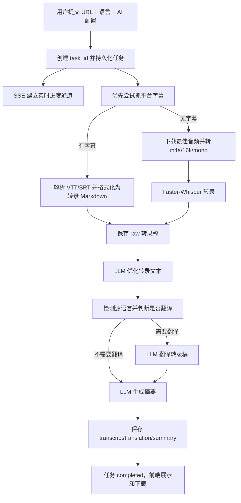

# podcast_generation_flow

# Podcast / Video 转录摘要生成流程迁移方案

本文从当前项目中完整提取“输入公开视频或 Podcast 链接，生成转录稿、可选翻译、AI 摘要、Markdown 下载文件”的业务方案。目标是让这套流程可以移植到其他项目，而不是只描述本项目代码。

> 当前项目里业务名偏向 `video`，但底层依赖 `yt-dlp`，实际支持 YouTube、Bilibili、TikTok、Apple Podcasts、SoundCloud 等 `yt-dlp` 可解析的平台。因此本文用“Podcast / Video”统称输入媒体。
> 

## 1. 业务能力边界

### 1.1 输入

用户提交一个公开视频或 Podcast URL，并选择或配置：

| 字段 | 来源 | 类型 | 是否必填 | 默认值 | 作用 |
| --- | --- | --- | --- | --- | --- |
| `url` | 前端表单 | string | 是 | 无 | 待处理的媒体链接，交给 `yt-dlp` 解析、抓字幕或下载音频。 |
| `summary_language` | 前端下拉框 | string | 否 | `zh` | 摘要输出语言；同时作为是否生成翻译的目标语言。 |
| `api_key` | 前端 AI Settings | string | 否 | 空 | 用户自带 OpenAI 兼容 API Key；传入后覆盖服务端环境变量。 |
| `model_base_url` | 前端 AI Settings | string | 否 | 空 | 用户自带 OpenAI 兼容接口地址；传入后覆盖服务端环境变量。 |
| `model_id` | 前端 AI Settings | string | 否 | 空 | 用户选择的模型 ID；传入后覆盖默认摘要模型。 |

### 1.2 输出

一次任务最终产出：

| 输出 | 文件名规则 | 内容 |
| --- | --- | --- |
| 原始转录稿 | `raw_{safe_title}_{short_id}.md` | 未经 LLM 优化的字幕或 Whisper 输出，加 `source: {url}`。 |
| 优化转录稿 | `transcript_{safe_title}_{short_id}.md` | LLM 优化后的转录文本，顶部加标题，底部加来源链接。 |
| 翻译稿 | `translation_{safe_title}_{short_id}.md` | 仅当源语言与摘要语言不一致时生成。 |
| 摘要稿 | `summary_{safe_title}_{short_id}.md` | LLM 生成的多语言摘要，底部加来源链接。 |

### 1.3 主路径



## 2. 运行时配置

### 2.1 服务端环境变量

| 环境变量 | 默认值 | 用途 | 迁移建议 |
| --- | --- | --- | --- |
| `OPENAI_API_KEY` | 无 | 服务端默认 OpenAI 兼容 API Key。 | 允许缺省，但缺省时摘要、优化、翻译会退化为返回原文或失败降级。 |
| `OPENAI_BASE_URL` | OpenAI SDK 默认端点；`start.py` 在未设置时会补 `https://oneapi.basevec.com/v1` | OpenAI 兼容接口地址。 | 建议统一放到服务配置；前端可覆盖。 |
| `HOST` | `0.0.0.0` | Uvicorn 监听地址。 | 容器部署保持 `0.0.0.0`。 |
| `PORT` | `8000` | 服务端口。 | 前端同域部署时无需额外配置 API 地址。 |
| `WHISPER_MODEL_SIZE` | `base` | Faster-Whisper 模型尺寸。 | 支持 `tiny`、`base`、`small`、`medium`、`large`；越大越准但越耗资源。 |
| `PRODUCTION_MODE` | `false` | 是否禁用热重载。 | 长任务建议生产模式，降低 SSE 断连概率。 |

### 2.2 启动模式

- 开发模式：`python start.py`
    - 启动 `uvicorn main:app --reload`。
    - 热重载方便开发，但长任务中 reload 可能导致 SSE 断开。
- 生产模式：`python start.py --prod` 或 `PRODUCTION_MODE=true`
    - 启动 `uvicorn main:app`，不加 `-reload`。
    - 推荐处理长视频、长 Podcast。
- Docker：`CMD ["python3", "start.py", "--prod"]`
    - 暴露 `8000`。
    - 默认内存限制示例：limit `2G`、reservation `1G`。

### 2.3 依赖

| 依赖 | 用途 |
| --- | --- |
| `fastapi` | Web API、表单接收、SSE 响应、文件下载。 |
| `uvicorn[standard]` | ASGI 服务。 |
| `python-multipart` | FastAPI 接收 `FormData`。 |
| `yt-dlp` | URL 解析、字幕提取、音频下载。 |
| `faster-whisper` | 无字幕时语音转文字。 |
| `openai` | OpenAI 兼容 Chat Completions。 |
| `pydantic` | FastAPI 生态依赖。 |
| `aiofiles` | 异步写 Markdown 文件。 |
| `ffmpeg` / `ffprobe` | 音频提取、转码、时长探测。 |

## 3. 前端用户配置入口

### 3.1 URL 输入

页面核心表单提交后触发转录流程：

- 表单 `submit` 阻止默认刷新。
- 调用 `_startTranscription()`。
- 校验 `videoUrl` 非空，否则显示“请输入有效 URL”。
- 进入 loading 状态：禁用按钮、显示进度面板、隐藏错误。

发送到后端的 `FormData`：

```
url=<用户输入 URL>
summary_language=<摘要语言下拉值>
api_key=<可选，AI Settings 中填写>
model_base_url=<可选，去掉末尾 />
model_id=<可选，模型下拉选择>
```

### 3.2 摘要语言配置

前端提供 11 种摘要语言：

| value | 展示名 |
| --- | --- |
| `en` | English |
| `zh` | 中文（简体） |
| `es` | Español |
| `fr` | Français |
| `de` | Deutsch |
| `it` | Italiano |
| `pt` | Português |
| `ru` | Русский |
| `ja` | 日本語 |
| `ko` | 한국어 |
| `ar` | العربية |

迁移时要注意：这个字段不仅控制摘要语言，也用于判断是否需要把转录稿翻译成目标语言。

### 3.3 AI Settings 配置

前端 AI Settings 包含：

| 字段 | DOM ID | 类型 | 说明 |
| --- | --- | --- | --- |
| Model API Base URL | `modelBaseUrl` | URL input | OpenAI 兼容接口地址，如 `https://openrouter.ai/api/v1`。发送前会 `trim()` 并删除末尾 `/`。 |
| API Key | `apiKeyInput` | password input | 用户自带 Key；只保存在浏览器本地，不写入服务端配置文件。 |
| Fetch Models | `fetchModelsBtn` | button | 调 `/api/models` 拉模型列表。 |
| Model | `modelSelect` | select | 默认空值表示“使用服务端默认模型”。 |

### 3.4 前端配置持久化

浏览器使用 `localStorage` 保存配置，key 为：

```
vt_settings
```

结构：

```json
{
  "baseUrl": "https://openrouter.ai/api/v1",
  "apiKey": "sk-...",
  "model": "gpt-4o-mini",
  "summaryLang": "zh"
}
```

加载策略：

1. 页面初始化读取 `vt_settings`。
2. 回填 `modelBaseUrl`、`apiKeyInput`、`summaryLanguage`。
3. 如果同时有 `baseUrl` 和 `apiKey`，延迟约 `400ms` 自动静默拉取模型列表。
4. 模型列表加载后再恢复上次选择的 `model`。

保存策略：

- `modelBaseUrl`、`apiKeyInput`、`modelSelect`、`summaryLanguage` 的 `change` 事件触发保存。
- Base URL 和 API Key 输入时还有 `900ms` debounce 自动 Fetch 模型。

### 3.5 模型列表拉取

前端调用：

```
POST /api/models
Content-Type: multipart/form-data

base_url=<用户填的 base url>
api_key=<用户填的 key>
```

后端逻辑：

1. `api_key` 优先，否则用 `OPENAI_API_KEY`。
2. `base_url.rstrip("/")` 优先，否则用 `OPENAI_BASE_URL`，再否则用 SDK 默认端点。
3. 没有 Key 时返回 `400`。
4. 初始化 `openai.OpenAI(api_key=..., base_url=...)`。
5. 调 `client.models.list()`。
6. 返回 `{"data": models}`，每个模型至少包含 `id` 和 `name`，其中 `name` 没有则等于 `id`。

前端兼容返回字段：

```jsx
const models = data.data || data.models || [];
```

## 4. 后端 API 与任务模型

### 4.1 API 列表

| 方法 | 路径 | 作用 |
| --- | --- | --- |
| `GET` | `/` | 返回 `static/index.html`。 |
| `POST` | `/api/models` | 代理 OpenAI 兼容模型列表。 |
| `POST` | `/api/process-video` | 创建 Podcast / Video 处理任务，是后端业务入口。 |
| `GET` | `/api/task-status/{task_id}` | 查询任务状态。 |
| `GET` | `/api/task-stream/{task_id}` | SSE 推送任务状态。 |
| `GET` | `/api/download/{filename}` | 下载 Markdown 文件。 |
| `DELETE` | `/api/task/{task_id}` | 取消并删除任务。 |
| `GET` | `/api/tasks/active` | 查询活跃任务。 |

### 4.2 任务状态结构

创建任务时写入：

```json
{
  "status": "processing",
  "progress": 0,
  "message": "开始处理视频...",
  "script": null,
  "summary": null,
  "error": null,
  "url": "<原始 URL>"
}
```

完成任务时扩展：

```json
{
  "status": "completed",
  "progress": 100,
  "message": "处理完成！",
  "video_title": "<标题>",
  "script": "<优化转录 Markdown 内容>",
  "summary": "<摘要 Markdown 内容>",
  "script_path": "<本地路径>",
  "summary_path": "<本地路径>",
  "short_id": "<task_id 去横线前 6 位>",
  "safe_title": "<清洗后的标题>",
  "detected_language": "<源语言>",
  "summary_language": "<目标摘要语言>",
  "raw_script_file": "raw_xxx.md",
  "translation": "<可选翻译内容>",
  "translation_path": "<可选翻译路径>",
  "translation_filename": "translation_xxx.md"
}
```

失败任务写入：

```json
{
  "status": "failed",
  "progress": 0,
  "message": "处理失败: <错误>",
  "error": "<错误>"
}
```

### 4.3 任务持久化

- 临时目录：项目根目录下 `temp/`。
- 状态文件：`temp/tasks.json`。
- 启动时加载历史任务状态。
- 每次任务状态更新后调用 `save_tasks()` 写回 JSON。
- 写文件使用 `threading.Lock()` 防止并发写冲突。

迁移建议：

- 单机可继续用 JSON 文件。
- 多实例部署必须替换为 Redis / 数据库，并把 SSE 事件广播改成跨实例消息队列。

### 4.4 URL 去重

后端用内存集合：

```python
processing_urls = set()
```

创建任务时：

1. 如果 URL 已在 `processing_urls` 中，遍历现有任务。
2. 找到相同 URL 的任务则直接返回旧 `task_id`。
3. 否则生成新 `task_id`。
4. 将 URL 加入 `processing_urls`。

注意：这是进程内去重，重启后失效，多实例不共享。

### 4.5 活跃任务管理

后端保存：

```python
active_tasks = {}
```

创建任务后：

```python
active_tasks[task_id] = asyncio.create_task(process_video_task(...))
```

删除任务时：

- 如果任务仍在 `active_tasks`，先 `cancel()`。
- 从任务字典中移除。
- 持久化 `tasks.json`。

## 5. SSE 实时进度

### 5.1 后端推送模型

每个任务维护多个 SSE 队列：

```python
sse_connections = {
  task_id: [asyncio.Queue(), ...]
}
```

广播时：

1. 遍历该 `task_id` 的所有 queue。
2. `queue.put(json.dumps(task_data, ensure_ascii=False))`。
3. 失败的 queue 从连接列表移除。
4. 如果连接列表空了，删除该 `task_id` 的连接项。

### 5.2 前端订阅

前端在收到 `task_id` 后调用：

```jsx
new EventSource(`/api/task-stream/${task_id}`)
```

`onmessage` 中解析任务 JSON：

- 更新进度条：`task.progress`。
- 更新文案：`task.message`。
- `completed` 时关闭 SSE，展示结果面板。
- `failed` 时关闭 SSE，展示错误。

### 5.3 SSE 断线兜底

前端 `EventSource.onerror` 时：

1. 关闭当前 SSE。
2. 调 `GET /api/task-status/{task_id}` 查询最终或当前状态。
3. 如果状态是 `completed`，直接展示结果。
4. 如果状态是 `failed`，展示错误。
5. 否则提示连接中断。

迁移建议：保留状态查询接口，因为 SSE 在代理、移动端、热重载、长任务下都可能断开。

## 6. 业务核心编排

后端真正的业务编排函数是：

```python
process_video_task(task_id, url, summary_language, api_key, model_base_url, model_id)
```

### 6.1 初始化请求级 Summarizer

如果前端传了 `api_key`：

```python
request_summarizer = Summarizer(
    api_key=api_key,
    base_url=model_base_url.rstrip("/") or None,
    model=model_id or None,
)
```

否则复用全局 `summarizer`，它使用环境变量。

这个设计支持“多用户自带 Key/模型”，避免全局配置互相污染。

### 6.2 阶段 1：优先抓平台字幕

更新任务：

```json
{"status":"processing", "progress":10, "message":"正在检测视频字幕..."}
```

调用：

```python
subtitle_text, sub_title, sub_lang = video_processor.fetch_subtitles(url, TEMP_DIR)
```

如果拿到字幕：

- `video_title = sub_title`
- `raw_script = subtitle_text`
- `transcriber.last_detected_language = sub_lang`
- 更新进度到 `40`，文案“字幕获取成功…正在处理文本…”

字幕路径是快路径：跳过音频下载与 Whisper，大幅节省时间和算力。

### 6.3 阶段 2：无字幕时下载音频

如果没有字幕：

```json
{"progress":15, "message":"未找到字幕，正在下载视频音频..."}
```

调用：

```python
audio_path, video_title = video_processor.download_and_convert(url, TEMP_DIR)
```

完成后：

```json
{"progress":35, "message":"音频下载完成，准备转录..."}
```

### 6.4 阶段 3：Whisper 转录

更新任务：

```json
{"progress":40, "message":"正在转录音频（Whisper）..."}
```

调用：

```python
raw_script = transcriber.transcribe(audio_path)
```

Whisper 输出格式与字幕快路径保持兼容，方便后续统一处理。

### 6.5 阶段 4：保存原始转录稿

生成：

```python
short_id = task_id.replace("-", "")[:6]
safe_title = _sanitize_title_for_filename(video_title)
raw_md_filename = f"raw_{safe_title}_{short_id}.md"
```

内容：

```
<raw_script>

source: <url>
```

任务里记录：

```json
{"raw_script_file": "raw_xxx.md"}
```

这个原始稿对调试很重要：可以区分“字幕/Whisper 质量问题”和“LLM 优化问题”。

### 6.6 阶段 5：优化转录文本

更新任务：

```json
{"progress":55, "message":"正在优化转录文本..."}
```

调用：

```python
script = request_summarizer.optimize_transcript(raw_script)
```

输出包装：

```python
script_with_title = f"#{video_title}\n\n{script}\n\nsource:{url}\n"
```

### 6.7 阶段 6：条件翻译

检测源语言：

```python
detected_language = transcriber.get_detected_language(raw_script)
```

判断是否翻译：

```python
translator.should_translate(detected_language, summary_language)
```

翻译条件：

- 源语言为空：不翻译。
- 目标语言为空：不翻译。
- 两者完全相同：不翻译。
- 中文变体之间互转不翻译：`zh`、`zh-cn`、`zh-hans`、`chinese`。
- 其他语言不一致：翻译。

如果需要翻译：

```json
{"progress":70, "message":"正在生成翻译..."}
```

调用：

```python
translation_content = translator.translate_text(script, summary_language, detected_language)
```

输出包装：

```python
translation_with_title = f"#{video_title}\n\n{translation_content}\n\nsource:{url}\n"
```

保存：

```python
translation_filename = f"translation_{safe_title}_{short_id}.md"
```

注意：当前翻译模块使用自己的 `Translator()` 全局实例，默认读环境变量，并且翻译模型硬编码 `gpt-4o`。如果迁移时要让翻译也使用用户前端指定模型，需要给 `Translator` 增加请求级初始化参数。

### 6.8 阶段 7：生成摘要

更新任务：

```json
{"progress":80, "message":"正在生成摘要..."}
```

调用：

```python
summary = request_summarizer.summarize(script, summary_language, video_title)
```

输出包装：

```python
summary_with_source = summary + f"\n\nsource:{url}\n"
```

保存：

```python
summary_filename = f"summary_{safe_title}_{short_id}.md"
```

### 6.9 阶段 8：完成任务

写入完整 `task_result`，进度 `100`：

```json
{"status":"completed", "progress":100, "message":"处理完成！"}
```

并广播给 SSE。

### 6.10 清理逻辑

最终无论成功失败：

- 从 `processing_urls` 移除 URL。
- 从 `active_tasks` 移除 `task_id`。
- 保存任务状态。

如果失败：

- `status = failed`
- `error = str(e)`
- `message = "处理失败: ..."`
- 广播失败状态。

## 7. 字幕抓取模块

模块职责：优先从平台拿字幕，避免下载音频和 Whisper。

### 7.1 `yt-dlp` 探测配置

先只探测信息，不下载：

```python
check_opts = {
  "quiet": True,
  "no_warnings": True,
  "noplaylist": True
}
info = ydl.extract_info(url, download=False)
```

取字段：

```python
video_title = info.get("title", "unknown")
manual_subs = info.get("subtitles") or {}
auto_caps = info.get("automatic_captions") or {}
```

### 7.2 字幕轨过滤

过滤掉 `live_chat`：

```python
manual_langs = [k for k in manual_subs if not k.startswith("live_chat")]
auto_langs = [k for k in auto_caps if not k.startswith("live_chat")]
```

优先级：

1. 有人工字幕时优先人工字幕。
2. 没人工字幕时使用自动字幕。
3. 两者都没有则返回 `None`，进入音频下载路径。

### 7.3 字幕语言选择

候选语言中按优先级选：

```python
["en", "en-orig", "zh-Hans", "zh-Hant", "zh", "ja", "ko", "fr", "de", "es"]
```

如果候选语言都不在优先级列表里，则选择候选列表第一个。

迁移建议：

- 如果产品目标是中文摘要，可以把 `zh-Hans` 放到 `en` 前面。
- 当前策略偏向先拿英文字幕，因为英文字幕质量通常更高。

### 7.4 字幕下载配置

```python
dl_opts = {
  "writesubtitles": prefer_manual,
  "writeautomaticsub": not prefer_manual,
  "subtitlesformat": "vtt/srt/best",
  "subtitleslangs": [prefer_lang],
  "skip_download": True,
  "outtmpl": "temp/subs_<uuid>/sub.%(ext)s",
  "quiet": True,
  "no_warnings": True,
  "noplaylist": True
}
```

只下载字幕文件，不下载音视频。

### 7.5 字幕解析优化

支持 VTT 和 SRT。

VTT 特殊处理：

- 跳过 `WEBVTT`、`Kind:`、`Language:`、`NOTE`、空行。
- 解析 `start --> end` 时间轴。
- 移除 HTML 标签、时间戳内联标记、样式标记。
- 针对 YouTube 自动字幕“滚动追加”现象做去重：同一句话逐字追加时，只保留一组 cue 的最终版本。
- 使用 `seen_texts` 去掉完全重复文本。

SRT 处理：

- 按空行切 block。
- 跳过序号行。
- 解析 `start --> end`。
- 合并多行字幕文本。
- 去重重复文本。

时间格式统一：

- 输入 `HH:MM:SS.mmm` 或 `MM:SS.mmm`。
- 输出 `MM:SS`。
- 小时会折算进分钟，例如 `01:02:03.000` -> `62:03`。

### 7.6 字幕格式化输出

字幕会格式化成与 Whisper 输出兼容的 Markdown：

```markdown
# Video Transcription

**Detected Language:** en
**Language Probability:** 1.00

## Transcription Content

**[00:01 - 00:04]**
字幕文本
```

这个兼容格式很关键：后续语言检测、优化、翻译、摘要不用区分“字幕来源”还是“Whisper 来源”。

### 7.7 字幕临时目录清理

字幕下载到：

```
temp/subs_<8位uuid>/
```

解析结束后会删除该临时字幕目录。失败时也尽量清理。

## 8. 音频下载与转码模块

### 8.1 默认下载配置

```python
ydl_opts = {
  "format": "bestaudio/best",
  "outtmpl": "%(title)s.%(ext)s",
  "postprocessors": [{
    "key": "FFmpegExtractAudio",
    "preferredcodec": "m4a",
    "preferredquality": "192"
  }],
  "postprocessor_args": ["-ac", "1", "-ar", "16000", "-movflags", "+faststart"],
  "prefer_ffmpeg": True,
  "quiet": True,
  "no_warnings": True,
  "noplaylist": True
}
```

关键优化：

- `bestaudio/best`：优先取最佳音频，提升转录质量。
- `m4a`：兼容性和体积平衡较好。
- `ac 1`：转单声道，减少 Whisper 处理量。
- `ar 16000`：16k 采样率，符合语音识别常用输入。
- `+faststart`：让 m4a 元数据前置，提升兼容性。
- `noplaylist=True`：避免用户贴播放列表时批量下载。

### 8.2 输出模板

每次下载使用任务级 UUID：

```
temp/audio_<8位uuid>.%(ext)s
```

这样避免多个任务标题相同导致覆盖。

### 8.3 下载流程

1. 确保 `temp/` 存在。
2. 拷贝默认 `ydl_opts`。
3. 覆盖 `outtmpl` 为本次任务模板。
4. `extract_info(url, download=False)` 获取标题。
5. `download([url])` 下载并转码。
6. 在输出目录中查找 `audio_<uuid>.*` 文件。
7. 优先识别 `.m4a`。
8. 找不到文件则抛错。
9. 可选调用 `ffprobe` 探测音频时长并写日志。

### 8.4 视频信息获取

另有 `get_video_info(url)` 可取：

```json
{
  "title": "...",
  "duration": 1234,
  "uploader": "...",
  "view_count": 123,
  "description": "..."
}
```

当前主流程没有强依赖它，但迁移到 Podcast 项目时可以用于展示节目标题、作者、时长。

## 9. Whisper 转录模块

### 9.1 模型初始化

```python
Transcriber(model_size="base")
```

当前构造函数默认 `base`。如果要使用环境变量，应在创建实例时传入：

```python
Transcriber(os.getenv("WHISPER_MODEL_SIZE", "base"))
```

模型延迟加载：首次转录时才加载。

加载配置：

```python
WhisperModel(model_size, device="cpu", compute_type="int8")
```

迁移建议：

- CPU 部署用 `int8` 合理。
- GPU 部署可改 `device="cuda"`，`compute_type="float16"`。
- 长音频建议 `small` 起步，质量要求高再用 `medium/large`。

### 9.2 转录参数

```python
segments, info = model.transcribe(
  audio_path,
  language=language,
  beam_size=5,
  best_of=5,
  temperature=[0.0, 0.2, 0.4],
  vad_filter=True,
  vad_parameters={
    "min_silence_duration_ms": 900,
    "speech_pad_ms": 300
  },
  no_speech_threshold=0.7,
  compression_ratio_threshold=2.3,
  log_prob_threshold=-1.0,
  word_timestamps=False
)
```

小优化解释：

- `beam_size=5`：提高解码质量。
- `best_of=5`：多候选选择更优文本。
- `temperature=[0.0,0.2,0.4]`：先保守解码，失败或质量差时逐步增加随机性。
- `vad_filter=True`：过滤静音，减少重复和幻觉。
- `min_silence_duration_ms=900`：较长静音才切分，减少过碎片段。
- `speech_pad_ms=300`：保留语音边缘，减少吞字。
- `no_speech_threshold=0.7`：提高无语音判定阈值。
- `compression_ratio_threshold=2.3`：检测重复文本或异常输出。
- `log_prob_threshold=-1.0`：过滤低置信片段。
- `word_timestamps=False`：不取词级时间戳，节省计算。

### 9.3 转录输出格式

Whisper 输出 Markdown：

```markdown
# Video Transcription

**Detected Language:** en
**Language Probability:** 0.98

## Transcription Content

**[00:01 - 00:04]**
转录文本
```

时间格式：

- 小于 1 小时：`MM:SS`
- 大于等于 1 小时：`HH:MM:SS`

### 9.4 语言检测保存

转录后保存：

```python
self.last_detected_language = info.language
self.last_language_probability = info.language_probability
```

`get_detected_language(transcript_text)` 优先从传入 Markdown 中解析 `Detected Language` / `检测语言` 行，解析不到再返回 `last_detected_language`。

支持语言列表：

```
zh, en, ja, ko, es, fr, de, it, pt, ru,
ar, hi, th, vi, tr, pl, nl, sv, da, no
```

## 10. 转录优化模块

### 10.1 Summarizer 初始化

```python
Summarizer(api_key=None, base_url=None, model=None)
```

优先级：参数 > 环境变量。

```python
effective_key = api_key or OPENAI_API_KEY
effective_url = base_url or OPENAI_BASE_URL
```

模型：

```python
fast_model = model or "gpt-3.5-turbo"
advanced_model = model or "gpt-4o"
```

如果前端传了 `model_id`，`fast_model` 和 `advanced_model` 都使用该模型。

### 10.2 无 API 降级

如果没有可用 OpenAI client：

- `optimize_transcript()` 返回原始转录。
- 摘要功能会失败或返回错误，迁移时建议显式提示用户配置 API Key。

### 10.3 预处理

优化前先移除转录 Markdown 中的：

- 时间戳行。
- 标题行。
- `Detected Language` / `Language Probability` 等元信息。

但保留全部口语、重复内容，不在本地强删，避免误删语义，交给 LLM 优化。

### 10.4 分块策略

优化阶段以字符数分块：

```python
max_chars_per_chunk = 4000
```

- 小于等于 4000 字符：单块格式化。
- 大于 4000 字符：长文本分块格式化。

项目里还保留了 token 估算方法：

```
中文字符 * 1.5 + 英文单词 * 1.3 + 文本长度 * 0.15 + 2500 prompt 开销
```

但当前主要采用字符分块，更稳定、简单。

### 10.5 格式化目标

LLM 优化转录稿的目标：

- 修正明显错别字和识别错误。
- 补全标点。
- 按语义自然分段。
- 保持原意，不额外总结。
- 保留重要口语信息。
- 输出 Markdown 段落。

### 10.6 后处理

优化后会做 Markdown 段落规范化：

- 统一换行符。
- 标题后补空行。
- 压缩多余空行。
- 保证段落之间使用空行分隔。

失败降级：

- 如果 LLM 优化失败，返回原始转录。
- 部分分块失败时，该块保留清理后的原文。

## 11. 摘要生成模块

### 11.1 摘要语言映射

```python
{
  "en": "English",
  "zh": "中文（简体）",
  "es": "Español",
  "fr": "Français",
  "de": "Deutsch",
  "it": "Italiano",
  "pt": "Português",
  "ru": "Русский",
  "ja": "日本語",
  "ko": "한국어",
  "ar": "العربية"
}
```

未知语言回退到 English。

### 11.2 摘要输入

摘要使用优化后的转录稿 `script`，而不是原始转录稿。

这样可以降低噪声，提高摘要质量。

### 11.3 摘要提示词设计

摘要提示词要求输出目标语言的结构化 Markdown。迁移时建议至少保留以下部分：

- 核心主题 / TL;DR。
- 关键要点。
- 重要细节或论据。
- 可执行启发或结论。
- 如果是 Podcast，可增加“嘉宾观点”“时间线”“提到的资源”。

### 11.4 长文本摘要

如果转录稿很长，应按段落或字符分块：

1. 每块生成局部摘要。
2. 合并局部摘要。
3. 再做一次全局摘要整理。

当前项目的优化阶段已经做长文本分块，摘要阶段也包含长文本处理逻辑。迁移时建议抽象为通用 `chunk_text()`，被优化、翻译、摘要共用。

### 11.5 摘要模型参数

默认使用：

- 快模型：`gpt-3.5-turbo`。
- 高质量模型：`gpt-4o`。
- 如果用户选择模型，两个阶段都使用用户模型。
- 常用参数：`temperature=0.1`，偏稳定。
- `max_tokens` 根据任务阶段设置，优化/翻译常见为 `4000`。

## 12. 翻译模块

### 12.1 Translator 初始化

`Translator()` 独立初始化 OpenAI client：

- 使用 `OPENAI_API_KEY`。
- 使用 `OPENAI_BASE_URL`。
- 缺 API Key 时 `client=None`，翻译不可用。

语言映射与摘要模块基本一致。

### 12.2 源语言检测

优先从转录 Markdown 元信息中解析：

- `*检测语言:**`
- `*Detected Language:**`

否则用简单字符规则：

- 包含中文字符：`zh`
- 包含日文假名：`ja`
- 包含韩文字符：`ko`
- 否则默认 `en`

### 12.3 是否翻译

```python
should_translate(source_language, target_language)
```

规则：

1. 任意一方为空：不翻译。
2. 完全相同：不翻译。
3. 中文变体互相转换：不翻译。
4. 其他不一致：翻译。

### 12.4 翻译分块

文本长度大于 `3000` 字符时启用分块翻译。

分块函数：

- 优先按空行段落切分。
- 每块最大 `4000` 字符。
- 单段超过限制时，按句子切。
- 仍超长则硬切。

### 12.5 翻译模型参数

当前硬编码：

```python
model="gpt-4o"
max_tokens=4000
temperature=0.1
```

提示词要求：

- 保持原文格式和结构。
- 准确传达原意，语言自然流畅。
- 保留专业术语。
- 不添加解释或注释。
- Markdown 格式保持不变。
- 分块翻译时提示“这是第 i / n 部分”，保持上下文连贯性。

迁移优化建议：把 `Translator` 改成和 `Summarizer` 一样支持请求级 `api_key`、`base_url`、`model`，避免用户自带模型只影响摘要、不影响翻译。

## 13. 文件命名与下载

### 13.1 标题清洗

```python
safe = re.sub(r"[^\w\-\s]", "", title)
safe = re.sub(r"\s+", "_", safe).strip("._-")
safe = safe[:80] or "untitled"
```

保留：

- 字母数字。
- 下划线。
- 连字符。
- 空格，最后转成 `_`。

限制 80 字符，避免文件名过长。

### 13.2 短 ID

```python
short_id = task_id.replace("-", "")[:6]
```

用于避免同名标题覆盖。

### 13.3 下载安全

下载接口限制：

- 只允许 `.md` 文件。
- 文件名必须位于 `temp/` 下。
- 通过 `Path.resolve()` 防目录穿越。
- 不存在返回 `404`。
- 使用 `FileResponse` 返回。

迁移时不要直接拼接用户路径；只能接受文件名，再映射到受控目录。

### 13.4 前端下载文件名兜底

前端下载前先查任务状态。如果任务里没有路径，则按规则兜底生成：

```
transcript_{safe_title || 'x'}_{short_id || 'x'}.md
summary_{safe_title || 'x'}_{short_id || 'x'}.md
translation_{safe_title || 'x'}_{short_id || 'x'}.md
```

## 14. 前端进度体验优化

### 14.1 服务端真实进度点

| 进度 | 阶段 |
| --- | --- |
| `0` | 创建任务。 |
| `10` | 检测字幕。 |
| `15` | 无字幕，开始下载音频。 |
| `35` | 音频下载完成。 |
| `40` | 字幕获取成功或开始 Whisper 转录。 |
| `55` | 优化转录文本。 |
| `70` | 生成翻译。 |
| `80` | 生成摘要。 |
| `100` | 完成。 |

### 14.2 前端平滑进度

前端不是只显示服务端进度，而是维护本地 smooth progress：

```jsx
sp = {
  enabled: false,
  current: 0,
  target: 15,
  lastServer: 0,
  interval: null,
  startTime: null,
  stage: 'preparing'
}
```

不同阶段给不同速度：

```jsx
{
  subtitle: 0.5,
  parsing: 0.3,
  downloading: 0.18,
  transcribing: 0.14,
  optimizing: 0.22,
  summarizing: 0.28
}
```

效果：即使服务端某阶段很久不推新进度，前端也会缓慢推进到目标值，用户不会以为卡死。

### 14.3 字幕快路径标识

如果后端 message 包含“字幕获取成功”或类似 subtitle 成功信息，前端：

- 设置阶段为 `subtitle`。
- 进度条添加 `subtitle-mode` 样式。
- 显示模式 badge。

这是一个小但重要的体验优化：用户知道这次跳过了 Whisper，会更快完成。

### 14.4 服务端消息本地化

后端消息主要是中文。前端会根据当前 UI 语言把常见阶段 message 映射成本地化文本，例如：

- 检测字幕。
- 下载音频。
- 转录中。
- 优化文本。
- 生成翻译。
- 生成摘要。
- 完成。

迁移到多语言项目时，不必让后端返回多语言 message；可以返回稳定阶段码 `stage`，前端本地化更干净。

## 15. 错误处理与降级

### 15.1 依赖检查

启动脚本检查：

- Python 包：`fastapi`、`uvicorn`、`yt-dlp`、`faster-whisper`、`openai`。
- FFmpeg 是否存在。

FFmpeg 缺失时给警告，不直接阻止启动，但无字幕路径可能失败。

### 15.2 OpenAI 缺失

- 启动时如果没有 `OPENAI_API_KEY` 会警告。
- 用户仍可在前端 AI Settings 中填写 Key。
- 如果既无服务端 Key 又无前端 Key：转录可以做，但优化、摘要、翻译不可完整工作。

### 15.3 字幕失败降级

字幕探测、下载、解析任何一步失败：

- 记录日志。
- 返回 `None`。
- 主流程自动进入音频下载 + Whisper。

### 15.4 LLM 失败降级

- 转录优化失败：返回原始转录。
- 翻译失败：返回原文。
- 分块中的某一块失败：该块保留原文，不影响其他块。
- 摘要失败：任务失败或返回错误，迁移时可改为返回基础摘要占位。

### 15.5 下载失败

- 非 `.md` 后缀拒绝。
- 文件不存在返回 `404`。
- 路径穿越返回 `400`。

## 16. 可迁移模块拆分建议

推荐在新项目里拆成这些服务：

```
media_pipeline/
  config.py              # 环境变量和默认配置
  task_store.py          # 任务状态持久化，JSON/Redis/DB 可替换
  events.py              # SSE/WebSocket/消息队列推送
  media_fetcher.py       # yt-dlp 字幕抓取和音频下载
  subtitle_parser.py     # VTT/SRT 解析、去重、格式化
  transcriber.py         # Faster-Whisper 封装
  llm_client.py          # OpenAI 兼容 client 工厂
  transcript_optimizer.py
  translator.py
  summarizer.py
  file_store.py          # 文件命名、保存、下载安全
  pipeline.py            # 主业务编排
```

接口建议：

```python
@dataclass
class PodcastJobConfig:
    url: str
    summary_language: str = "zh"
    api_key: str | None = None
    model_base_url: str | None = None
    model_id: str | None = None
    whisper_model_size: str = "base"
    prefer_subtitles: bool = True
    subtitle_language_priority: list[str] = field(default_factory=lambda: ["en", "zh-Hans", "zh", "ja", "ko"])
```

```python
@dataclass
class PodcastJobResult:
    task_id: str
    title: str
    detected_language: str | None
    transcript_markdown: str
    summary_markdown: str
    translation_markdown: str | None
    raw_file: str
    transcript_file: str
    summary_file: str
    translation_file: str | None
```

主编排伪代码：

```python
async def run_podcast_generation(job: PodcastJobConfig) -> PodcastJobResult:
    task = await task_store.create(job.url)
    llm = llm_factory.create(job.api_key, job.model_base_url, job.model_id)

    await events.progress(task.id, 10, "detecting_subtitles")
    subtitles = await media_fetcher.fetch_subtitles(job.url, priority=job.subtitle_language_priority)

    if subtitles:
        title = subtitles.title
        raw_transcript = subtitle_parser.to_transcript_markdown(subtitles)
        detected_language = subtitles.language
        await events.progress(task.id, 40, "subtitle_ready")
    else:
        await events.progress(task.id, 15, "downloading_audio")
        audio_path, title = await media_fetcher.download_audio(job.url)
        await events.progress(task.id, 40, "transcribing")
        raw_transcript = await transcriber.transcribe(audio_path, model_size=job.whisper_model_size)
        detected_language = transcriber.detected_language

    raw_file = await file_store.save_raw(title, task.id, raw_transcript, job.url)

    await events.progress(task.id, 55, "optimizing_transcript")
    transcript = await optimizer.optimize(raw_transcript, llm)

    translation = None
    if should_translate(detected_language, job.summary_language):
        await events.progress(task.id, 70, "translating")
        translation = await translator.translate(transcript, detected_language, job.summary_language, llm)

    await events.progress(task.id, 80, "summarizing")
    summary = await summarizer.summarize(transcript, job.summary_language, title, llm)

    files = await file_store.save_outputs(title, task.id, job.url, transcript, summary, translation)
    await events.complete(task.id, files)
    return PodcastJobResult(...)
```

## 17. 移植时不要漏掉的小优化清单

- 字幕优先，只有无字幕才下载音频。
- 人工字幕优先于自动字幕。
- 过滤 `live_chat` 字幕轨。
- 字幕语言有优先级列表，不能随机取。
- 字幕只下载 `vtt/srt/best`，并 `skip_download=True`。
- VTT 要处理 YouTube 自动字幕滚动追加去重。
- 字幕输出格式要和 Whisper 输出统一。
- 音频下载必须 `noplaylist=True`，避免误处理整个播放列表。
- 音频转 `m4a`、单声道、16k，降低体积和转录负担。
- Whisper 使用 VAD 和温度递增，减少静音幻觉和重复。
- 保存 raw 转录稿，方便排查质量问题。
- LLM 优化前只移除时间戳和元信息，不要本地过度清洗口语内容。
- 长文本按字符分块，分块失败保留原文块。
- 摘要使用优化后的 transcript，不直接用 raw。
- 翻译只在源语言与目标摘要语言不一致时触发。
- 中文变体之间不翻译。
- 用户前端 API Key / Base URL / Model 要覆盖服务端默认值。
- 模型列表通过后端代理拉取，不让前端直接跨域访问模型服务。
- 用户配置保存到 `localStorage`，并在模型列表加载后恢复模型选择。
- 任务状态持久化，SSE 断线可用状态接口恢复。
- 进度条做本地平滑，不完全依赖服务端离散进度。
- 下载接口只允许 `.md` 且防路径穿越。
- 文件名要清洗并截断，附加短 ID 防重复。
- 生产模式禁用热重载，降低长任务 SSE 断连概率。

## 18. 当前项目中值得迁移时改进的点

- `WHISPER_MODEL_SIZE` 在环境变量中声明，但当前全局 `Transcriber()` 没显式传入该环境变量；迁移时应接入。
- `Translator` 当前不吃前端传入的 `api_key`、`model_base_url`、`model_id`，只用环境变量和硬编码 `gpt-4o`；迁移时建议统一 LLM client。
- 任务、去重、SSE 连接都在内存或本地 JSON，适合单机；多实例需要 Redis/DB/消息队列。
- 后端 message 建议改为稳定 `stage` 枚举，前端负责本地化，减少字符串匹配。
- 临时音频文件当前主要用于转录，迁移时可在任务完成后清理，避免磁盘增长。
- 对超长 Podcast 可增加章节级摘要、时间戳摘要、speaker diarization、断点续跑。

## 19. 最小可用迁移步骤

1. 搭建 FastAPI 或等价后端，提供 `/process`、`/status/{id}`、`/stream/{id}`、`/download/{file}`。
2. 实现任务存储，至少包含 `status`、`progress`、`message`、`url`、输出文件路径。
3. 封装 OpenAI 兼容 client，支持服务端默认配置和用户请求级覆盖。
4. 接入 `yt-dlp` 字幕快路径，支持 VTT/SRT 解析和去重。
5. 接入无字幕下载音频路径，FFmpeg 转 `m4a/16k/mono`。
6. 接入 Faster-Whisper，输出统一 Markdown 转录格式。
7. 保存 raw 转录稿。
8. 接入 LLM transcript optimizer。
9. 接入条件翻译。
10. 接入摘要生成。
11. 保存 Markdown 输出并提供安全下载。
12. 前端实现 URL、摘要语言、API Key、Base URL、Model 配置和本地持久化。
13. 前端实现 SSE 进度、断线状态查询兜底、平滑进度条、结果下载。

## 20. 关键源码对应表

| 方案部分 | 当前项目文件 |
| --- | --- |
| 前端配置、提交、SSE、下载 | `static/app.js` |
| 页面表单和配置项 | `static/index.html` |
| API、任务状态、业务编排 | `backend/main.py` |
| 字幕抓取、音频下载、FFmpeg 转码 | `backend/video_processor.py` |
| Faster-Whisper 转录 | `backend/transcriber.py` |
| 转录优化、摘要生成 | `backend/summarizer.py` |
| 条件翻译 | `backend/translator.py` |
| 启动与依赖检查 | `start.py` |
| 环境变量示例 | `.env.example` |
| Docker 生产启动 | `Dockerfile`、`docker-compose.yml` |