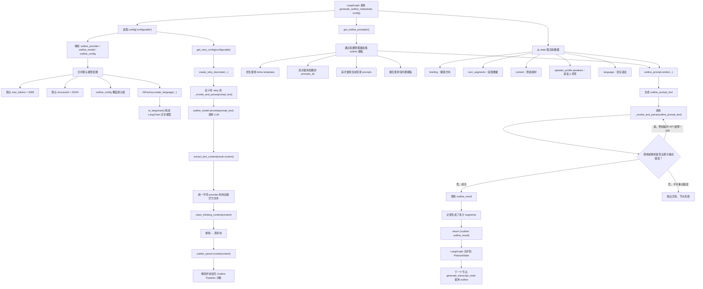

# 创建播客

先掌握 episode_profile，再学 briefing / briefing_suffix，然后看 speakers_config.json、episodes_config.json，最后再改 prompt 模板和 provider/model 配置。

这个项目的核心就是：

`用户文档 / 文本内容
    ↓
LLM 生成 outline 大纲
    ↓
LLM 根据 outline 逐段生成 script / transcript 对话稿
    ↓
按 Dialogue 分片调用 TTS
    ↓
生成多个 mp3 clips
    ↓
合并 clips
    ↓
得到最终 podcast 音频`

对应到代码就是这条 LangGraph workflow：

E:\py\podcast-creator\src\podcast_creator\graph.py:22

`START
  → generate_outline
  → generate_transcript
  → generate_all_audio
  → combine_audio
  → END`

[podcast_generation_flow](https://www.notion.so/podcast_generation_flow-34e711589ea5806fa39ff736680438cc?pvs=21)

[podcast_generation_pipeline](https://www.notion.so/podcast_generation_pipeline-34e711589ea580a3982fdba953433c13?pvs=21)